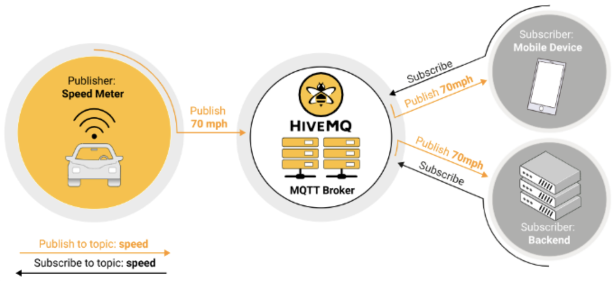

# Data Collection

### Motivation

Since we have FedFT (see platform) algorithm whose correctness is verified by some experiences, devices, and student resources on our campus, we can make this theory a practical application. Therefore, we decided to develop a FedCampus platform based on FedFT algorithm and may cater to more FA algorithms in the future.

### Preview

This project implements an Android App to collect health and exercise data for FL training. It has two main function: data collection and local differential privacy (DP). Besides, this project also needs support iot for FL training, e.g: using smart watch.

<figure><figcaption></figcaption></figure>

#### Preparation

* Android development skill: If you are new, refer to first line of code by guolin
* Network programming knowledge

#### Resources

* Apollo server: [https://blog.csdn.net/weixin\_39808143/article/details/112576683](https://blog.csdn.net/weixin\_39808143/article/details/112576683)&#x20;
* Ali Cloud: [https://help.aliyun.com/document\_detail/163032.html](https://help.aliyun.com/document\_detail/163032.html)
* Health Kit: [https://developer.huawei.com/consumer/cn/doc/development/HMSCore-Guides/apply-kitservice-0000001050071707](https://developer.huawei.com/consumer/cn/doc/development/HMSCore-Guides/apply-kitservice-0000001050071707)
* Health Kit Data: [https://developer.huawei.com/consumer/cn/doc/development/HMSCore-Guides/overview-0000001147638696](https://developer.huawei.com/consumer/cn/doc/development/HMSCore-Guides/overview-0000001147638696)
* Health Kit Overview：[https://developer.huawei.com/consumer/cn/codelab/HMSHealthKit-StepCount/index.html#0](https://developer.huawei.com/consumer/cn/codelab/HMSHealthKit-StepCount/index.html#0)
* Semi-finished code


**Semi-code**: for easiness, just look at what is used by MainActivity.


| Time                     | Task          | Progress |
| ------------------------ | ------------- | -------- |
| During Semester (A)      | Communication |          |
| During Semester (A)      | Data Storage  |          |
| During Semester (B)      | Algorithm     |          |
| During Semester (B)      | UI            |          |
| 1st month (Summer) (A,B) | Health Kit    |          |
| 2nd month (Summer) (B)   | Smart Watch   |          |
| 2nd month (Summer) (A,B) | Test App      |          |

#### Task

* Communication
* Data Storage
* Algorithm
* UI
* HealthKit & FL Platform

#### Communication

* Build a Apollo broker
  * Build a server to monitor message communication
  *   To verify correctness, use Mqtt.fx / MqttX / EMqtt

      <figure><figcaption></figcaption></figure>
*   Fix the bug of MQTT subscribe

    * Publish function is implemented well. But there's a little bug in subscribe function: messageArrived is not called when subscribing message (in MainActivity.java)
    * You can also implement TCP version and forget about all the structure of MQTT if you are good at TCP

    <figure><figcaption></figcaption></figure>

#### Data Storage

* Local storage: LitePal (finished)
* Cloud storage: Ali Cloud (supporting MQTT), setup a dashboard by the instruction in resources (to do)

#### UI (Easy task)

* Beautify
* English version for international student
* .png>).png>)

#### Algorithm

* Implement local differential privacy algorithm

#### Health Kit

* After obtaining the authentication, plug in health kit to let the app automatically collect data
* Smart watch plug-in: collect data from the watch

